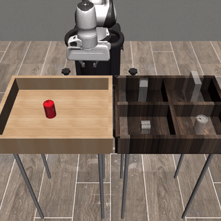
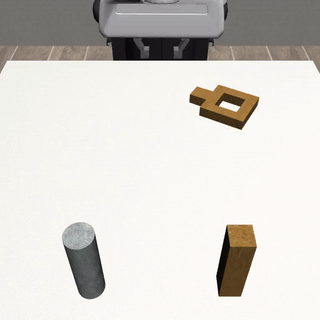

# Refine

Diffusion behavioral cloning on Robomimic.

A diffusion policy trained with BC on demonstrations, predicting short action chunks via a DDIM sampler over a frozen MLP epsilon predictor.

## Results (Robomimic, low-dim, proficient-human)

| Task   | Success rate |
|--------|--------------|
| Lift   | 98%          |
| Can    | 96%          |
| Square | 82%          |

Evaluated over 20 episodes per task with DDIM (10 steps), `pred_horizon=4`.

Sample rollouts:

| Can | Square |
|-----|--------|
|  |  |

## Layout

```
config/         per-task BC hyperparameters
data/           Robomimic hdf5 loader and min-max normalizer
model/          diffusion policy (MLP epsilon predictor, EMA, DDIM sampler)
train_bc.py     BC pretraining of the diffusion policy
evaluate.py     rollout the BC diffusion policy
record_eval.py  same, with video recording
```

## Training

```
python train_bc.py \
    --data_path datasets/lift/ph/low_dim_v141.hdf5 \
    --save_dir checkpoints/bc/lift \
    --task lift \
    --pred_horizon 4 \
    --diffusion_steps 100 \
    --hidden_dims 1024 1024 1024 \
    --epochs 3000
```

Per-task configs live in `config/bc_{lift,can,square}.yaml`. Checkpoints store the model, optimizer, EMA, both normalizers, observation keys, and the full arg dict.

Evaluate:

```
python evaluate.py --checkpoint checkpoints/bc/lift/state_3000.pt --n_episodes 20 --ddim_steps 10
```

## Requirements

- PyTorch (CUDA recommended)
- robosuite, robomimic
- h5py, numpy

Datasets: standard Robomimic `low_dim_v141.hdf5` files under `datasets/<task>/ph/`.
